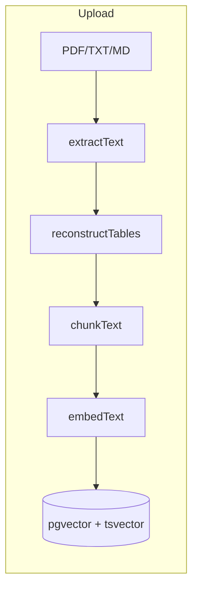
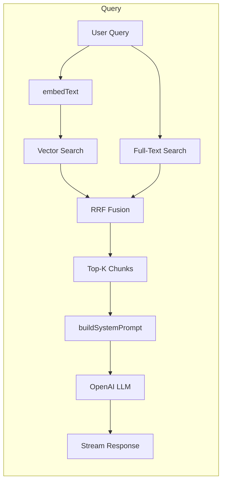
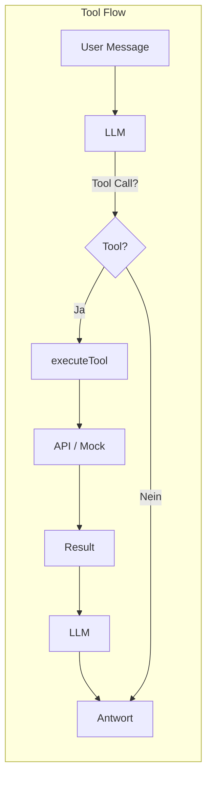
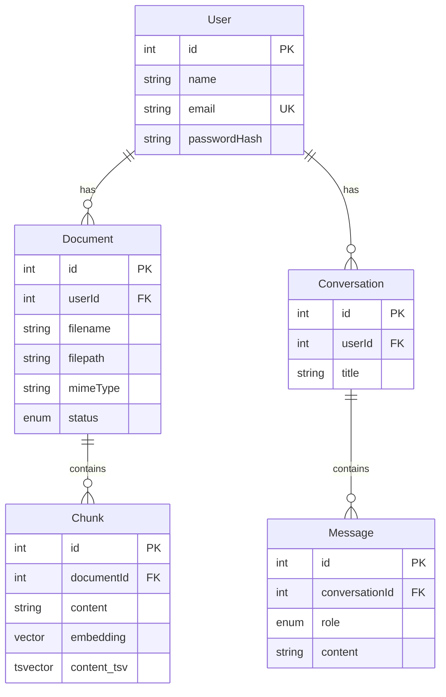

# Architektur

## Upload-Pipeline

Dokumente werden extrahiert, gechunkt, embeddet und in PostgreSQL gespeichert.



| Schritt | Datei | Beschreibung |
|---------|-------|--------------|
| Upload | `app/api/documents/upload/route.ts` | Datei empfangen, MIME-Type prüfen |
| Extract | `lib/rag/pdf.ts` | pdf-parse für PDF, UTF-8 für TXT/MD |
| Chunk | `lib/rag/chunker.ts` | tiktoken, 300 Tokens, 50 Overlap |
| Embed | `lib/openai/embed.ts` | text-embedding-3-small |
| Store | Prisma + raw SQL | Chunk + embedding in `Chunk`, tsvector für FTS |

---

## Query-Pipeline (RAG)

Anfrage wird embeddet, Hybrid Search liefert Top-Chunks, LLM antwortet mit Kontext.



| Schritt | Datei | Beschreibung |
|---------|-------|--------------|
| Embed | `lib/openai/embed.ts` | Query vektorisieren |
| Search | `lib/rag/search.ts` | Vector + FTS, RRF-Fusion |
| Context | `lib/rag/context.ts` | System-Prompt mit Chunks + User-Name |
| Chat | `app/api/chat/route.ts` | LLM aufrufen, streamen |

---

## Tool-Flow (dynamische Daten)

LLM entscheidet, ob ein Tool nötig ist; Backend führt es aus und liefert das Ergebnis zurück.



| Komponente | Datei | Beschreibung |
|------------|-------|--------------|
| Tool Definitions | `lib/tools/index.ts` | 5 Tools (Urlaub, Feiertage, Wetter, News, Meeting) |
| Retry | `lib/tools/fetch.ts` | fetchWithRetry, 3 Versuche, Backoff |
| Execution | `lib/tools/index.ts` | executeTool Dispatcher |
| Integration | `app/api/chat/route.ts` | Tool-Call erkennen, ausführen, Ergebnis an LLM |

---

## Verzeichnisstruktur

```
rag_chatbot/
├── app/
│   ├── (app)/           # Geschützte Routen (Chat, RAG)
│   │   ├── chat/        # Chat-UI
│   │   └── rag/         # Dokumenten-Verwaltung
│   ├── (auth)/          # Login
│   └── api/             # API Routes
│       ├── auth/        # JWT, Login
│       ├── chat/        # RAG + Tool Calling
│       ├── conversations/
│       └── documents/   # Upload, CRUD
├── components/          # React-Komponenten (chat, rag, ui)
├── config/              # OpenAI, RAG-Parameter
├── lib/
│   ├── rag/             # Extraktion, Chunking, Search, Context
│   ├── openai/          # Client, Embeddings
│   ├── tools/           # Tool-Definitionen, executeTool, fetchWithRetry
│   ├── auth/
│   └── logger.ts
├── prisma/              # Schema, Migrations
├── store/               # Zustand (chat, auth, documents)
└── test/
```

---

## Datenbankschema



| Tabelle | Zweck |
|---------|-------|
| User | Auth, Name für personalisierte Ansprache |
| Document | Hochgeladene Dateien, Metadaten |
| Chunk | Text-Chunks mit pgvector embedding + tsvector für FTS |
| Conversation | Chat-Verlauf |
| Message | Einzelne Nachrichten (user/assistant) |
