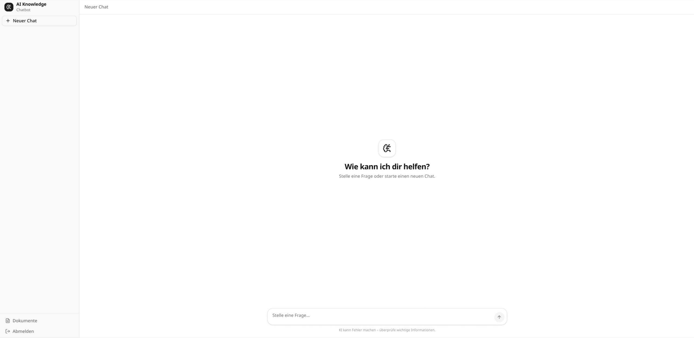
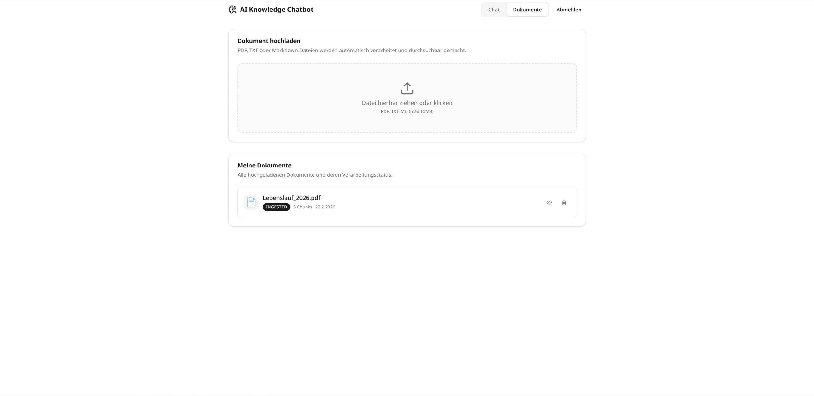
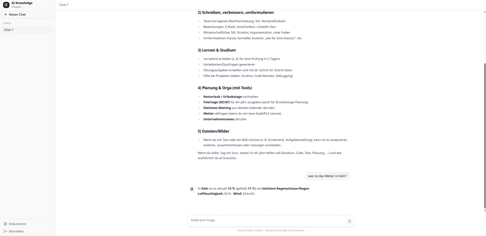
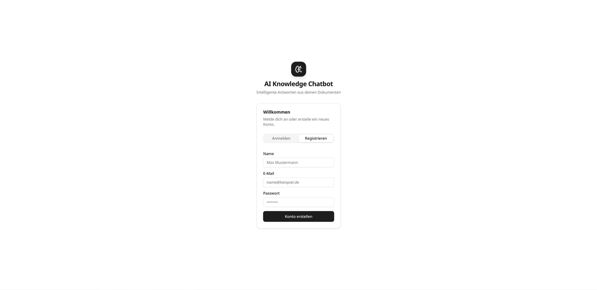
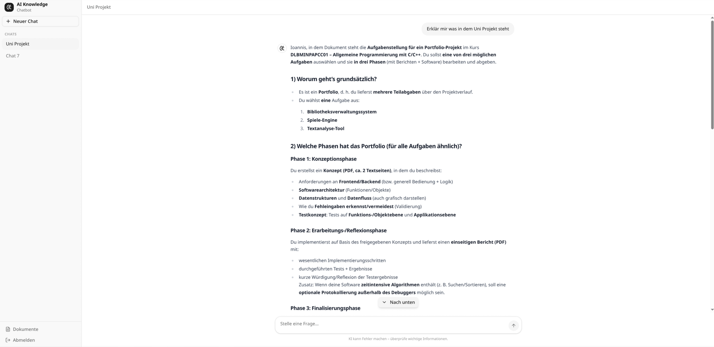
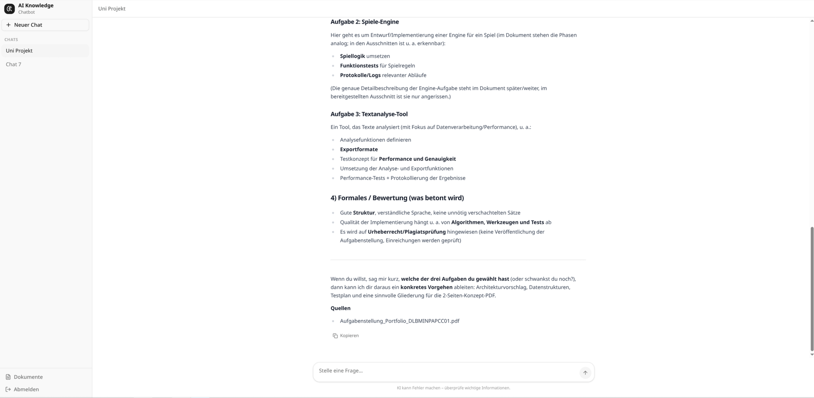

# AI Knowledge Chatbot

RAG-Chatbot mit Next.js: Beantwortet Fragen aus hochgeladenen Dokumenten (PDF, TXT, Markdown) und ruft dynamische Daten per Tool Calling ab. Hybrid Search (Vector + Full-Text), Streaming-Antworten, Conversation History.

## Screenshots

| Chat | Dokumente |
|------|-----------|
|  |  |

| Chat mit Antwort | Dokumenten-Upload |
|------------------|-------------------|
|  |  |

| Tool-Antwort | Login |
|--------------|-------|
|  |  |

## Quick Start

**Voraussetzungen:** Node.js 20+, Docker & Docker Compose

```bash
npm install
cp .env.example .env
docker compose -f docker-compose-dev.yml up -d
npx prisma migrate dev
npm run dev
```

→ [http://localhost:3000](http://localhost:3000)

## Architektur

```
Upload → Extract → Chunk → Embed → pgvector + tsvector
                                          ↓
Query → Embed + Full-Text → Hybrid Search (RRF) → LLM (GPT) → Antwort + Quellen

Query → LLM entscheidet (Tool?) → Tool Execution → LLM → Antwort
```

### Komponenten

| Bereich | Technologie |
|---------|-------------|
| Framework | Next.js 16 (App Router) |
| DB | PostgreSQL + pgvector |
| ORM | Prisma 7 |
| LLM | OpenAI Responses API + Tool Calling |
| Auth | bcrypt, jsonwebtoken |

## Verfügbare Tools (KI-Funktionen)

Die KI kann folgende Tools nutzen – sie entscheidet eigenständig, wann ein Tool aufgerufen wird:

| Tool | Beschreibung | Datenquelle |
|------|--------------|-------------|
| **Urlaubstage** | Verbleibende Urlaubstage des Nutzers | Mock (user-spezifisch) |
| **Feiertage** | Gesetzliche Feiertage DE/AT für ein Jahr | [date.nager.at](https://date.nager.at) |
| **Wetter** | Aktuelles Wetter für eine Stadt | [wttr.in](https://wttr.in) |
| **Unternehmensnews** | Neueste Unternehmensnachrichten | Mock |
| **Nächstes Meeting** | Nächstes geplantes Meeting aus dem Kalender | Mock |

Zusätzlich: **Dokumenten-Kontext** – hochgeladene PDFs, TXT- und Markdown-Dateien werden durchsucht und als Kontext für Antworten genutzt.

## Annahmen

- Eingabeformate: PDF, TXT, Markdown (kein OCR für gescannte PDFs)
- Tools sind teils gemockt (Urlaub, News, Meeting), teils echte APIs (Feiertage, Wetter)
- Conversation History ist implementiert – letzte N Nachrichten werden an den LLM übergeben
- Kein OAuth – JWT reicht für den Scope

## Tech Stack

| Bereich | Technologie |
|---------|-------------|
| Framework | Next.js 16 (App Router) |
| DB | PostgreSQL + pgvector |
| ORM | Prisma 7 |
| LLM | OpenAI Responses API + Tool Calling |
| Auth | bcrypt, jsonwebtoken |
| PDF | pdf-parse + heuristische Tabellenrekonstruktion |
| Chunking | js-tiktoken |
| Validation | zod |

## Weitere Dokumentation

- [ARCHITECTURE.md](ARCHITECTURE.md) – Pipeline-Diagramme, Verzeichnisstruktur, DB-Schema
- [DESIGN.md](DESIGN.md) – Design-Entscheidungen, Alternativen, Verbesserungen
